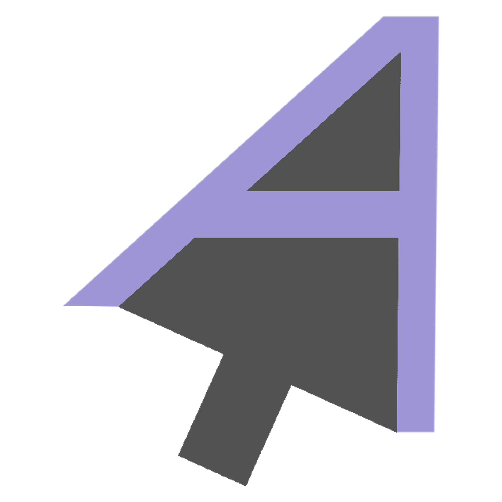

 
 
<a href="https://auilibrary.ehan.dev/">
  

    
  

</a>
 
 
<h1 align="center">aUiLibrary</h1>

  a User-interface Library that simplifies web development.

  <a href="https://auilibrary.ehan.dev/"> Website, Docs, & Demo </a> -
  <a href="https://github.com/EhanAhamed/aUiLibrary"> Source Code (GitHub) </a> -
  <a href="https://www.npmjs.com/package/auilibrary"> Node Module (npm) </a> -
  <a href="https://github.com/EhanAhamed/auilibrary.ehan.dev/">
    Website Source Code (GitHub)
  </a>

 

Don't question it.

 

<h1 align="center">aUiLibrary</h1>

  Copyright (c) 2022 Ehan Ahamed and contributors  
  Licensed Under the UPL-1.0 License  
  <a href="https://github.com/EhanAhamed/aUiLibrary/blob/main/LICENSE.txt"
    >See License File</a
  >

 
 
